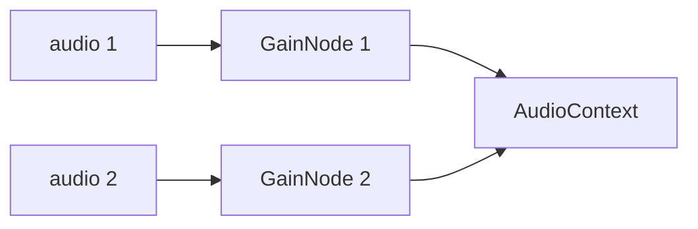

# Oktomusic Player

## References

- https://developer.mozilla.org/en-US/docs/Web/API/Web_Audio_API
- https://www.w3.org/TR/webaudio-1.1
  - https://developer.mozilla.org/en-US/docs/Web/API/MediaElementAudioSourceNode
  - https://developer.mozilla.org/en-US/docs/Web/API/GainNode
  - https://developer.mozilla.org/en-US/docs/Web/API/AnalyserNode
  - https://developer.mozilla.org/en-US/docs/Web/API/AudioContext

## Audio Context Diagram

We rely on HTTP range streaming, so the only easy way to stream the files is to use the HTML5 `<audio>` element as the source for the audio context.

This allows us to take advantage of browser caching and built-in streaming capabilities.
The `MediaElementAudioSourceNode` connects the `<audio>` element to the Web Audio API, allowing us to manipulate the audio data in real-time.

The `GainNode` are used to control the volume of each audio source independently for crossfade effects.

Finally, the audio data is sent to the `AudioContext`, which handles the playback and output to the user's speakers or headphones.

The queue is a list of tracks with next and previously played tracks.

Hitting play on a playlist/album will reset this queue to the new list of tracks.

We intend to later add a priority queue like the manual queue in Spotify with derived states.
