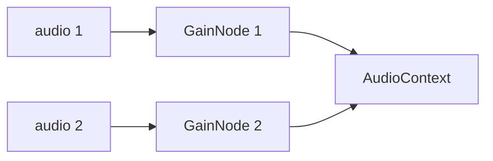

# Oktomusic Player

## References

- https://developer.mozilla.org/en-US/docs/Web/API/Web_Audio_API
- https://www.w3.org/TR/webaudio-1.1
  - https://developer.mozilla.org/en-US/docs/Web/API/MediaElementAudioSourceNode
  - https://developer.mozilla.org/en-US/docs/Web/API/GainNode
  - https://developer.mozilla.org/en-US/docs/Web/API/AnalyserNode
  - https://developer.mozilla.org/en-US/docs/Web/API/AudioContext

## Audio Context Diagram

We rely on HTTP range streaming, so the only easy way to stream the files is to use the HTML5 `<audio>` element as the source for the audio context.

This allows us to take advantage of browser caching and built-in streaming capabilities.
The `MediaElementAudioSourceNode` connects the `<audio>` element to the Web Audio API, allowing us to manipulate the audio data in real-time.

The `GainNode` are used to control the volume of each audio source independently for crossfade effects.

Finally, the audio data is sent to the `AudioContext`, which handles the playback and output to the user's speakers or headphones.

The queue is a list of tracks with next and previously played tracks.

Hitting play on a playlist/album will reset this queue to the new list of tracks.

We intend to later add a priority queue like the manual queue in Spotify with derived states.

## Atom Tree & Playback Reasoning

This player uses a small Jotai atom graph to keep the playback pipeline explicit, testable, and easy to reason about. The overall goal is to:

- Keep “source of truth” atoms minimal and deterministic.
- Derive UI state from those atoms rather than from DOM state.
- Ensure side effects (audio element control, Media Session API) only depend on atoms.

Below is the atom map and the reasoning behind each branch.

### Core Atoms (Source of Truth)

- `playerAudioContextAtom`: Holds the current `AudioContext` instance (or `null`).
  - Created in the provider; closed on cleanup.
  - Kept as an atom so any component can reflect audio engine readiness.

- `playerQueueAtom`: The current playback queue as an ordered list of `TrackWithAlbum`.
  - Only the queue is stored, not any derived view (e.g. current track).

- `playerQueueIndexAtom`: Index of the current track in the queue.
  - Kept as a primitive `number` to simplify bounds and looping logic.

- `playerShouldPlayAtom`: Boolean “intent” from UI/MediaSession.
  - This is the desired state from the user (play vs pause), not the actual DOM state.
  - It decouples user intent from the actual playback pipeline (buffering, loading, errors).

- `playerSeekRequestAtom`: A one-shot seek request in milliseconds.
  - This atom is consumed and reset by the provider once the DOM seek is applied.

### Derived Queue Atoms

- `playerQueueCurrentTrack`: Derived track based on queue + index.
  - Handles empty queue and invalid index safely.
  - Keeps components safe from array bounds issues.

- `playerQueueCurrentTrackFile`: Derived media URL for the current track.
  - Encapsulates URL building and track validation in one place.

### Playback State Atoms

- `playerPlaybackPositionAtom`: Current position in milliseconds.
  - Updated by the HTML media element `timeupdate` events.

- `playerPlaybackDurationAtom`: Current track duration in milliseconds.
  - Updated by `durationchange` and `loadedmetadata` events.

- `playerPlaybackStateAtom`: Canonical playback state: `idle | playing | paused | buffering`.
  - Updated by audio element events (`play`, `pause`, `waiting`, `playing`, `canplay`).
  - This drives UI icons and Media Session state.

- `playerIsPlayingAtom`: Derived boolean from `playerPlaybackStateAtom`.
- `playerIsBufferingAtom`: Derived boolean from `playerPlaybackStateAtom`.

### Control Atoms (Actions)

- `handlePreviousTrackAtom`: Moves index backward with wrap-around.
  - Also sets `playerShouldPlayAtom` to `true` to ensure the next track starts.

- `handleNextTrackAtom`: Moves index forward with wrap-around.
  - Also sets `playerShouldPlayAtom` to `true` to ensure the next track starts.

- `requestPlaybackToggleAtom`: Toggles user intent for playback.
- `requestPlaybackPlayAtom`: Sets user intent to play.
- `requestPlaybackPauseAtom`: Sets user intent to pause.
- `requestSeekAtom`: Emits a seek request in milliseconds.

These action atoms give UI and Media Session handlers a single interface to change playback intent without touching the DOM directly.

## Playback Flow (End-to-End)

This is the typical sequence when a user plays a track:

1. The UI (controls or Media Session) sets `playerShouldPlayAtom = true`.
2. The `PlayerProvider` effect sees `shouldPlay` and current track file.
3. The audio element is instructed to `play()`, and `AudioContext` is resumed if needed.
4. The audio element emits `playing`, updating `playerPlaybackStateAtom`.
5. `playerPlaybackPositionAtom` updates via `timeupdate` events.
6. The seek bar and Media Session position state reflect the updated position.

When the track ends:

1. The audio element emits `ended`.
2. The provider sets `playerPlaybackStateAtom = paused` and triggers `handleNextTrackAtom`.
3. `handleNextTrackAtom` updates the index and forces `playerShouldPlayAtom = true`.
4. The next track begins automatically if available.

## Buffering Handling

- Buffering is a playback state, not a separate boolean.
- Events `waiting`, `stalled`, and `seeking` flip state to `buffering`.
- Events `playing` and `canplay` flip back to `playing`.
- UI elements can show lightweight feedback (e.g. “Buffering…”) by observing `playerIsBufferingAtom`.

## Seek Handling

- UI sends a seek request with `requestSeekAtom`.
- The provider performs the actual seek on the audio element and then clears the request atom.
- This keeps the UI stateless and avoids manipulating the media element directly in components.

## Media Session Integration

Media Session is kept in sync via atoms:

- `playerPlaybackStateAtom` drives `navigator.mediaSession.playbackState`.
- `playerPlaybackPositionAtom` + `playerPlaybackDurationAtom` drive `setPositionState`.
- Playback actions map to atom-based requests:
  - `play` → `requestPlaybackPlayAtom`
  - `pause` → `requestPlaybackPauseAtom`
  - `previoustrack` → `handlePreviousTrackAtom`
  - `nexttrack` → `handleNextTrackAtom`
  - `seekto` → `requestSeekAtom`

This keeps the browser media UI (OS controls and lock screen) consistent with the in-app state and seek bar.

## Why This Architecture

The architecture makes it easy to:

- Replace the audio backend later (e.g. WebAudio vs. remote playback) without rewriting UI.
- Keep UI reactive and minimal; controls are stateless.
- Debug behavior from atoms rather than complex DOM state.
- Support additional features (queue manipulation, crossfade, gapless playback) with minimal refactors.

When adding features, prefer:

- **New source atoms** only when truly necessary.
- **Derived atoms** for anything computed from source atoms.
- **Action atoms** for every user-initiated action.

That keeps the graph clean and predictable.
