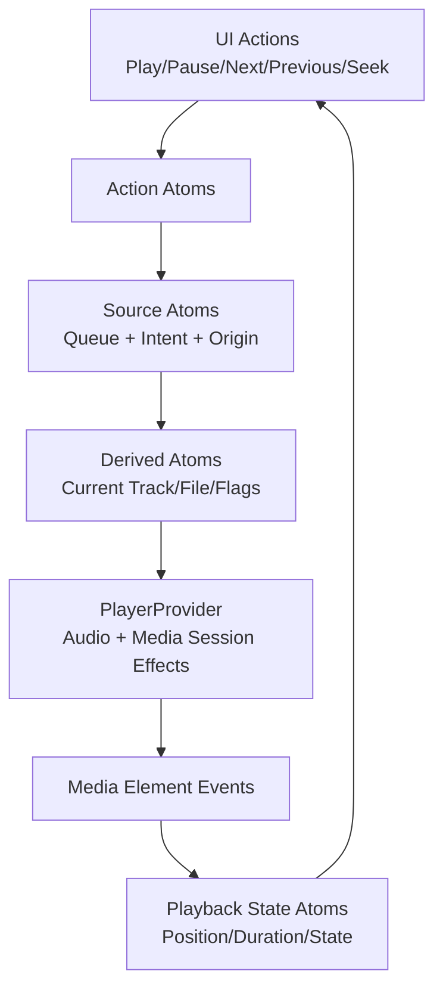
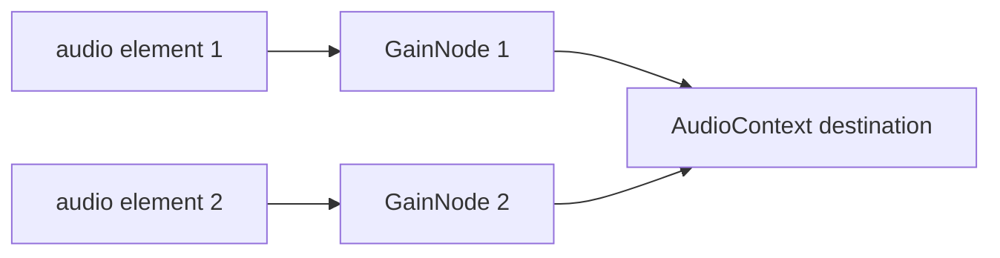

# Oktomusic Player State Machine Design

This document explains how playback works in Oktomusic, from a user point of view and from an implementation point of view.

It is written in layers:

1. A plain-language model for non-technical readers.
2. A structured state-machine model for contributors.
3. Detailed atom responsibilities and transition rules for maintainers.

---

## 1) What The Player Is Doing (Plain Language)

Think of the player as a train system with two lanes:

- **Main lane**: the album or playlist you started from.
- **Manual lane**: tracks you explicitly added with “Add to queue”.

The manual lane has priority for **next** playback. When manual tracks are present, they are played first. Once manual tracks are exhausted, playback returns to the main lane.

The player also tracks two kinds of truth:

- **What the user wants**: play or pause (`playerShouldPlayAtom`).
- **What audio is currently doing**: idle/playing/paused/buffering (`playerPlaybackStateAtom`).

Keeping those separate prevents UI glitches and makes buffering transitions stable.

---

## 2) Design Goals

The state machine is designed to be:

- **Predictable**: same input action gives same result.
- **Composable**: UI components can read derived state without mutating core state.
- **Recoverable**: queue origin can be tracked and restored.
- **Safe**: invalid indices and empty queues are handled explicitly.
- **Extensible**: shuffle/repeat/crossfade can be added without rewriting the entire graph.

---

## 3) High-Level Architecture

```mermaid
flowchart TD
    UI[UI Actions\nPlay/Pause/Next/Previous/Seek] --> Actions[Action Atoms]
    Actions --> Source[Source Atoms\nQueue + Intent + Origin]
    Source --> Derived[Derived Atoms\nCurrent Track/File/Flags]
    Derived --> Provider[PlayerProvider\nAudio + Media Session Effects]
    Provider --> Events[Media Element Events]
    Events --> Playback[Playback State Atoms\nPosition/Duration/State]
    Playback --> UI
```

Key principle: **only action atoms write** to source atoms. Most UI reads derived atoms.

---

## 4) Core Concepts

### 4.1 Queue Types

- `playerQueueAtom`: the main queue (album/playlist order).
- `playerQueueManualAtom`: manual queue (priority queue for user-added tracks).

### 4.2 Which Queue Is Active

- `playerQueueCurrentTrackSourceAtom` can be:
  - `"main"`
  - `"manual"`
  - `null`

This atom is the machine selector for current playback source.

### 4.3 Main Queue Cursor

- `playerQueueMainIndexAtom`: index in main queue.

Manual queue has no cursor: current manual track is always the first item (`manualQueue[0]`).

### 4.4 User Intent vs Runtime State

- **Intent**: `playerShouldPlayAtom`.
- **Runtime**: `playerPlaybackStateAtom` (`idle | playing | paused | buffering`).

During transitions (loading next track, buffering), intent can remain “play” while runtime temporarily changes. This is intentional and prevents icon flicker.

---

## 5) Atom Catalog

### 5.1 Source Atoms (single source of truth)

- `playerAudioContextAtom`
- `playerQueueAtom`
- `playerQueueMainIndexAtom`
- `playerQueueManualAtom`
- `playerQueueCurrentTrackSourceAtom`
- `playerQueueFromAtom`
- `playerQueueFromTracksAtom`
- `playerShouldPlayAtom`
- `playerSeekRequestAtom`
- `playerPlaybackPositionAtom`
- `playerPlaybackDurationAtom`
- `playerPlaybackStateAtom`

### 5.2 Derived Atoms

- `playerQueueCurrentTrack`
- `playerQueueCurrentTrackFile`
- `playerCurrentTrackColors`
- `playerIsPlayingAtom`
- `playerIsBufferingAtom`

### 5.3 Action Atoms

- `handlePreviousTrackAtom`
- `handleNextTrackAtom`
- `handleSeekToQueueIndexAtom`
- `replaceQueueAtom`
- `addToQueueAtom`
- `requestPlaybackToggleAtom`
- `requestPlaybackPlayAtom`
- `requestPlaybackPauseAtom`
- `requestSeekAtom`

---

## 6) State Machine Rules

### 6.1 Invariants

These should always be true:

1. If both queues are empty, source should be `null` and playback intent should eventually be `false`.
2. If source is `"manual"`, current track resolves from `manualQueue[0]`.
3. If source is `"main"`, current track resolves from `playerQueueMainIndexAtom` in `playerQueueAtom`.
4. Main index is always wrapped/clamped to valid range before use.
5. `replaceQueueAtom` resets manual queue.

### 6.2 Next Transition

When `handleNextTrackAtom` is called:

1. If source is manual:
   - consume current manual item (`slice(1)`)
   - if manual still has items, stay on manual
   - else fall back to main and advance main index
2. Else if manual queue has items, jump to manual
3. Else advance main queue index with wrapping
4. Else no tracks remain (`source = null`, `shouldPlay = false`)

### 6.3 Previous Transition

When `handlePreviousTrackAtom` is called:

1. If source is manual:
   - consume current manual item
   - if manual still has items, stay on manual
   - else return to **current main item** (do not double-step backward)
2. Else move main index backward with wrapping
3. If no main but manual exists, keep/return manual
4. If nothing exists, clear source and stop intent

### 6.4 Seek-To-Main-Index

`handleSeekToQueueIndexAtom` always targets main queue and sets source to `"main"`.

---

## 7) How Current Track Is Computed

`playerQueueCurrentTrack` resolves in this order:

1. If source is manual and manual has items -> first manual track.
2. Else if main has items -> main index track (or fallback to first if index invalid).
3. Else if manual still has items -> first manual track.
4. Else -> `null`.

This fallback order avoids crashes and guarantees a best-effort track resolution.

---

## 8) Playback Pipeline (Audio Layer)

Audio uses two HTML `<audio>` elements connected to Web Audio nodes.

```mermaid
flowchart LR
    A1[audio element 1] --> G1[GainNode 1]
    A2[audio element 2] --> G2[GainNode 2]
    G1 --> AC[AudioContext destination]
    G2 --> AC
```

Why this model:

- Uses browser-native streaming and caching.
- Supports future crossfade/gapless patterns.
- Keeps state machine independent from DSP details.

---

## 9) UI Contract

### 9.1 Icons

- Controls should use **intent** (`playerShouldPlayAtom`) for stable play/pause icon during transitions.
- Runtime state (`playerPlaybackStateAtom`) is still useful for buffering indicators.

### 9.2 Queue Screens

- “Now Playing” reads `playerQueueCurrentTrack`.
- Manual queue section should hide when empty.
- Main queue section should only display when queue origin exists (`playerQueueFromAtom`).

### 9.3 Collection Blue Button

Album/playlist blue button behavior:

1. If page matches current main queue origin and source is main, button toggles play/pause.
2. Otherwise, button loads that collection into main queue and starts playback.

---

## 10) Queue Origin Semantics

`playerQueueFromAtom` tracks where current main queue came from:

- album (`id`, `meta`)
- playlist (`id`, `meta`)

This enables:

- correct labels in queue UI (“Next from ...”)
- collection-aware play/pause toggle
- future queue restoration across reloads

Important rule: set queue origin **before** replacing queue when starting collection playback.

---

## 11) Edge Cases Covered

- Empty queues
- Invalid main index
- Manual queue exhaustion
- Manual -> main return on previous/next
- Play requested with no current track
- Buffering transitions
- Seek while paused or playing

---

## 12) Troubleshooting Guide

### Symptom: Play icon flickers to Play on next/previous

Likely cause:

- UI icon bound to runtime state (`playerPlaybackStateAtom`) instead of intent (`playerShouldPlayAtom`).

Fix:

- Use intent for icon rendering.

### Symptom: Queue label shows unknown source

Likely cause:

- `playerQueueFromAtom` not set before `replaceQueueAtom`.

Fix:

- Set origin first in album/playlist and track-list play entrypoints.

### Symptom: Previous from manual lands too far back in main queue

Likely cause:

- manual -> main transition decremented main index again.

Fix:

- return to current main index when manual queue is exhausted.

---

## 13) Extension Plan (Advanced)

### 13.1 Shuffle

Recommended additions:

- `playerShuffleEnabledAtom`
- deterministic shuffle map or permutation atom
- keep `playerQueueAtom` immutable; derive shuffled order separately

### 13.2 Repeat Modes

Recommended enum:

- `off | one | all`

Integrate in next/ended transitions, not in UI layer.

### 13.3 Crossfade

Use dual-audio architecture:

- preload next track on secondary element
- schedule gain ramps on two gain nodes

### 13.4 Persistence

Persist minimal snapshot:

- queue origin
- queue content ids
- main index
- manual queue ids
- source
- shouldPlay flag

Restore through action atoms to keep invariants intact.

---

## 14) External References

- MDN Web Audio API: https://developer.mozilla.org/en-US/docs/Web/API/Web_Audio_API
- Web Audio spec: https://www.w3.org/TR/webaudio-1.1
- MDN MediaElementAudioSourceNode: https://developer.mozilla.org/en-US/docs/Web/API/MediaElementAudioSourceNode
- MDN GainNode: https://developer.mozilla.org/en-US/docs/Web/API/GainNode
- MDN AudioContext: https://developer.mozilla.org/en-US/docs/Web/API/AudioContext

---

## 15) Summary

The player state machine is built around a simple idea:

- model user intent explicitly,
- keep queue source explicit (`main` vs `manual`),
- derive everything else,
- and isolate side effects in provider/event boundaries.

That design keeps the system understandable for users and stable for developers, while leaving room for advanced playback features.
