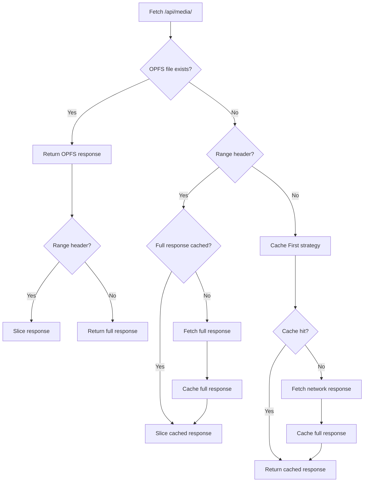

# Service Worker caching behavior

This document describes how the Service Worker handles media requests and caching, including the range-request limitations.

## Routes handled

- Media streaming route: `/api/media/{cuid}`
  - Pattern used by the Service Worker: `^/api/media/([^/]+)$`

## Caches used

- Media cache name: `flac-stream-cache`
  - Purpose: store full FLAC responses for streaming.
  - Strategy: Cache First with expiration rules from the Service Worker config.

## Request flow

1. **OPFS first (authoritative)**
   - If a matching FLAC file exists in OPFS (`/files/{cuid}.flac`), the response is returned immediately.
   - Range requests are served by slicing the full OPFS response.

2. **Range requests**
   - If the request has a `Range` header, the Service Worker tries to serve a partial response by slicing a **full** cached response.
   - If no full response is cached, the Service Worker fetches the full response (without `Range`) from the network, caches it, and then slices it for the requested range.

3. **Non-range requests**
   - The Workbox Cache First strategy is used.
   - If cache hit: return cached response.
   - If cache miss: fetch from network and cache the full 200 response (subject to cache policy).

## Range request limitation

Caching real HTTP 206 range responses is **not supported** by the Cache API and therefore not supported by Workbox. Workbox’s range handling is designed to **return partial responses from a full cached response**, not to store partial responses. This is why the range request plugin operates on a full 200 response and slices it to satisfy the range.

## Mermaid overview

