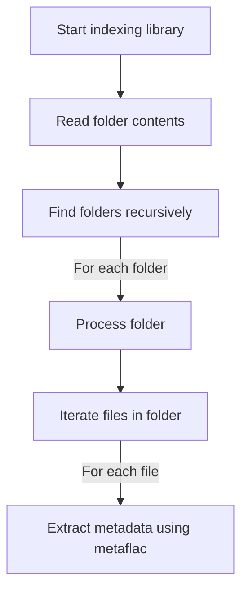

# Music collection

Single read-only source of truth for your music collection.

A folder structure with a folder per album, containing only FLAC files.

Each folder is validated separately, all files should have consistent metadata and the exact same album related metadata.

Metadata is composed of [Vorbis comments](https://xiph.org/vorbis/doc/v-comment.html) extracted using [`metaflac`](https://github.com/xiph/flac).

> [!INFO]
> Sadly, the standard is very loose, so we have to define our own rules for required tags and formats.

| Tag Name      | Required | Format            | Unique | Multiple Allowed |
| ------------- | -------- | ----------------- | ------ | ---------------- |
| `TITLE`       | Yes      | String            | No     | No               |
| `ARTIST`      | Yes      | String            | No     | Yes              |
| `ALBUM`       | Yes      | String            | Yes    | No               |
| `TRACKNUMBER` | Yes      | Integer (1-based) | No     | No               |
| `TOTALTRACKS` | Yes      | Integer (1-based) | No     | No               |
| `DISCNUMBER`  | Yes      | Integer (1-based) | No     | No               |
| `TOTALDISCS`  | Yes      | Integer (1-based) | No     | No               |

Additionally, the cover of the album must be present as a file in the folder, named either `cover.png`, `cover.avif`, `cover.jpg` or `cover.jpeg`, taken by this order of preference.

These will be converted to lossy AVIF images of various sizes, so the ideal would be to use a lossless PNG or AVIF image as source.

The app support lyrics stored as separate files in the album folder, named as the track title. The supported formats are [TTML](https://en.wikipedia.org/wiki/Timed_Text_Markup_Language) `.ttml` and both [LRC](<https://en.wikipedia.org/wiki/LRC_(file_format)>) and [Enhanced LRC](<https://en.wikipedia.org/wiki/LRC_(file_format)#A2_extension_(Enhanced_LRC_format)>) `.lrc`.

---

I want to create an indexing job for my music file collection.

I consider:

- The music collection is in a folder with only FLAC format
- Every track must have an album (considered a single if only one track), if not that's an error
- File metadata is entirely validated (if required tags are present and well formated) with a already defined logic (based on metaflac output), if it doesn't pass it's rejected and a warning is issued

I want:

- A structure above files constructed from file metadata, with albums/artists/tracks all linked.
- Files should not be tied entirely to their track, because that would break stuff like playlists and listening stats. If a file is deleted in DB, the track previously created should stay present but prevent playing.
- Streaming, as well as transcoding generation is based on files. Transcodings must only be generated if the files are successfully linked to a track, if the source file is deleted they should be also deleted
- Files must be renameable, and you may be able to swap a set of files for higher quality ones while keeping the same track/album object in database
- The data model must be good enough to allow for multiple tracks with the same name (and ISRC). ISRC should not be used as primary key I think as well since their may be different albums that may share a single track.
- ***

after extracting the metadata of a folder album, assert the consistency of the metadata of it's files

Compare consistency of album related metadata:

- ALBUM
- TRACKNUMBER and DISCNUMBER. Unsure totals

---

## Indexing process

---

build a robust error and warning report system

Create required types and enums, make so that I can retreive via GraphQL a list of jobs and their problems, as well as getting live feedback

In an error I want to display in frontend:

- A localised error message (the reason why I want clearly defined error/warning enum like types)
- The path relative to the collection folder of the source file or folder if relevant for the warning
