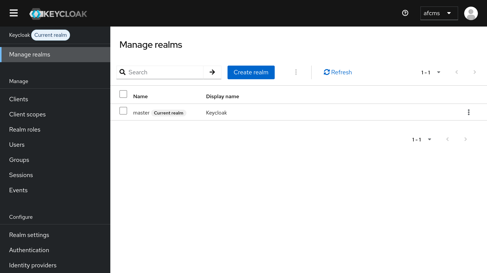
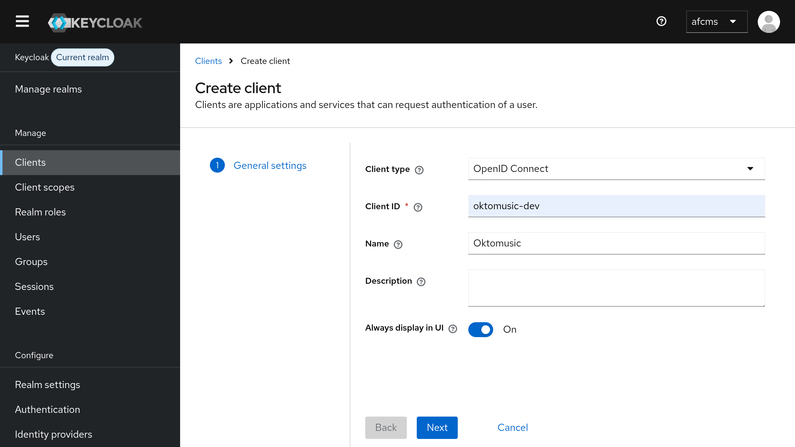
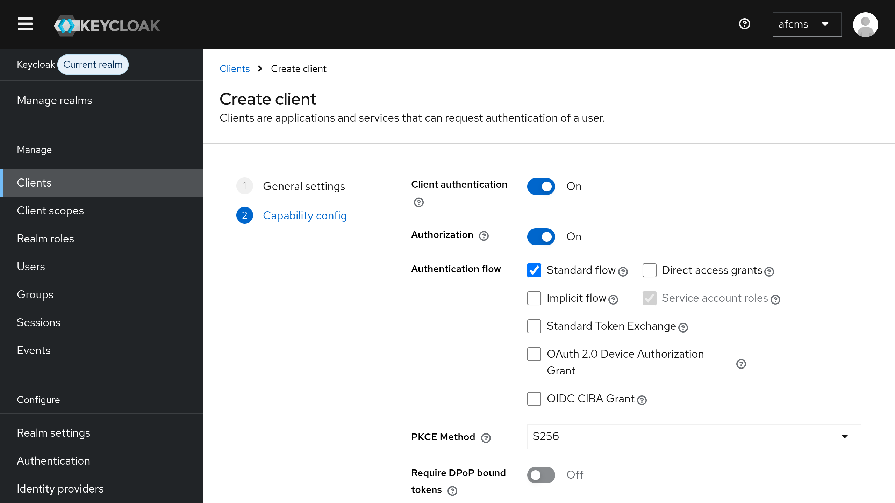
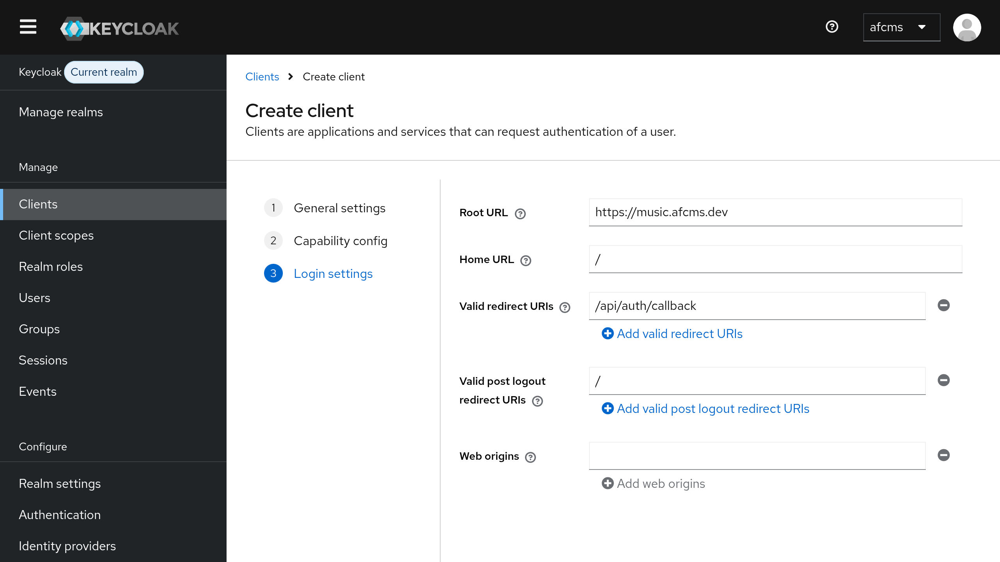
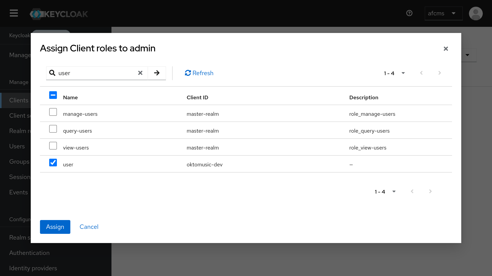

# OpenID Connect configuration

> [!IMPORTANT]
> Oktomusic delegates all user authentication to an external **OpenID Connect Provider**.
>
> The main reasons are:
>
> - Simplicity in the application architecture
> - Delegate accounts security to specialized software
> - Give full control for user management to the administrator
> - Leverage existing battle-tested identity management solutions
>
> OpenID is a widely adopted standard with many availlable providers:
>
> - [Keycloak](https://www.keycloak.org) (exemple in this guide)
> - [Authentik](https://goauthentik.io)

> [!NOTE]
> For an introduction to OpenID Connect, please refer to the official documentation: [How OpenID Connect works](https://openid.net/developers/how-connect-works).
>
> - Oktomusic is a **OpenID Connect RP** (Relying Party)
> - It delegates all user authentication to an external **OpenID Provider** (OP)
> - It uses **Authorization Code Flow** with **PKCE** and server-side sessions
> - It relies on **OpenID Connect Core** and **OpenID Connect Discovery** protocols

## Keycloak

When using [Keycloak](https://www.keycloak.org) as **OpenID Provider**, you can follow these steps to create a client for Oktomusic.

### Login to Admin Console

Keycloak use **realms** to isolate different environments.

The default created realm is `master`, regardless if you create a new one or not, the realm name will be needed to configure Oktomusic later.



### Create a new OpenID Client

Now you can go to `Clients > Create client` to create a new OpenID Client.

- Keep `Client type` to `OpenID Connect`
- Set `Client ID` to a realm-unique name that will be used in URLs, such as `oktomusic` (or any other name you prefer)
- Set other options as you prefer, then click `Next`



- Switch `Client Authentication` to `ON`
- Switch `Authorization` to `ON`
- Set `PKCE Method` to `S256`
- Click `Next`



- Set `Root URL` to your Oktomusic base URL, e.g. `https://oktomusic.example.com`
- Set `Home URL` to `/` (relative to the base URL)
- Add `/api/auth/callback` to `Valid Redirect URIs`
- Add `/` to `Valid Post Logout Redirect URIs`
- Click `Save`



### Create Roles

The app relies on two specific roles to manage access control. `admin` and `user`.

There are multiple ways to provide roles to clients, here we will create them as **Client Roles** to assign manually.

You can create mappers to automatically assign client roles based on user attributes or groups later if needed.

- Go in your client page, then click on the `Roles` tab
- Click on `Add Role` and add a role named `user`
- Go back and add another role named `admin`
- This time in the role settings go to the `Associated Roles` tab
- Assign the `user` role as an associated client role of `admin`
- In the role list the `admin` role should be displayed as composite now



### Configure Oktomusic

```ini
# URL of the Keycloak realm
# Constructed from your Keycloak domain and realm name
OIDC_ISSUER=https://<keycloak-domain>/realms/<realm-name>

# Client ID created previously
OIDC_CLIENT_ID=oktomusic-dev

# Client Secret generated by Keycloak
# Retreive it from the 'Credentials' tab of your client
OIDC_CLIENT_SECRET=change-me

# Where Oktomusic should read roles from inside the *access token* (JWT).
#
# For Keycloak, if you created client roles
# (as in this guide), they are typically exposed at:
#   resource_access.<client_id>.roles
# The <client_id> placeholder is replaced with OIDC_CLIENT_ID automatically.
OIDC_ROLES_PATH=resource_access.<client_id>.roles
```
