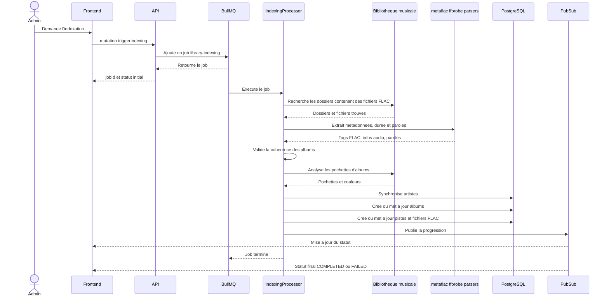

```mermaid
sequenceDiagram
    actor Admin
    participant Frontend
    participant API
    participant Queue as BullMQ
    participant Worker as IndexingProcessor
    participant Files as Bibliotheque musicale
    participant Tools as metaflac ffprobe parsers
    participant DB as PostgreSQL
    participant PubSub

    Admin->>Frontend: Demande l'indexation
    Frontend->>API: mutation triggerIndexing
    API->>Queue: Ajoute un job library-indexing
    Queue-->>API: Retourne le job
    API-->>Frontend: jobId et statut initial

    Queue->>Worker: Execute le job

    Worker->>Files: Recherche les dossiers contenant des fichiers FLAC
    Files-->>Worker: Dossiers et fichiers trouves

    Worker->>Tools: Extrait metadonnees, duree et paroles
    Tools-->>Worker: Tags FLAC, infos audio, paroles

    Worker->>Worker: Valide la coherence des albums
    Worker->>Files: Analyse les pochettes d'albums
    Files-->>Worker: Pochettes et couleurs

    Worker->>DB: Synchronise artistes
    Worker->>DB: Cree ou met a jour albums
    Worker->>DB: Cree ou met a jour pistes et fichiers FLAC

    Worker->>PubSub: Publie la progression
    PubSub-->>Frontend: Mise a jour du statut

    Worker-->>Queue: Job termine
    PubSub-->>Frontend: Statut final COMPLETED ou FAILED
```
